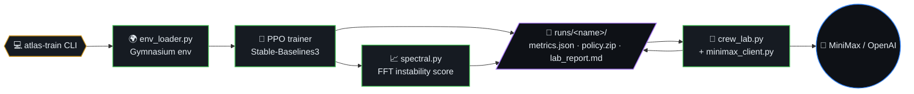
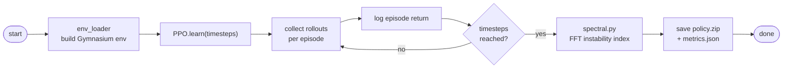
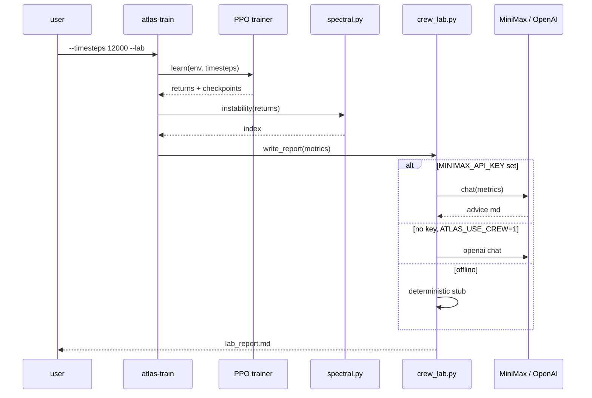
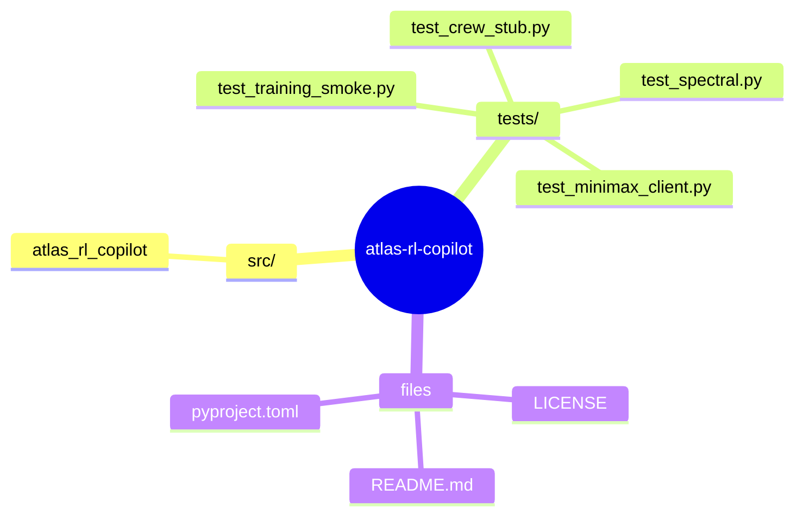
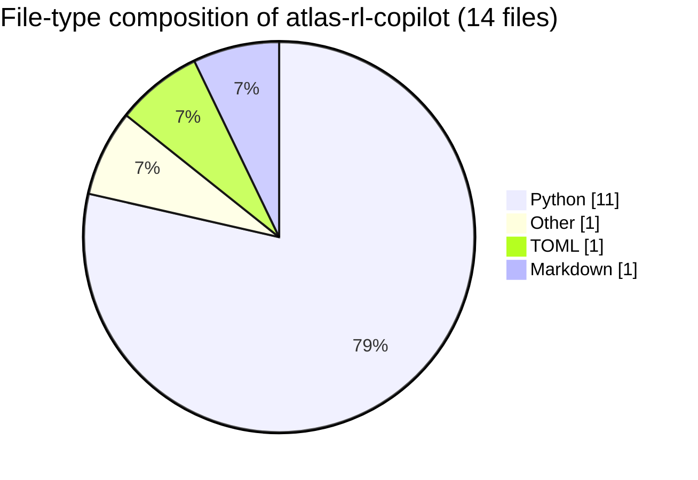

# Atlas RL Copilot

**Idea:** combine **real on-policy RL** (PPO via [Stable-Baselines3](https://github.com/DLR-RM/stable-baselines3)) with a **spectral instability score** on episode returns—useful when a learning curve is noisy—and an optional **CrewAI** “lab” pass that turns `metrics.json` into a short Markdown report.

This is a small Python project you can extend (harder envs, sweeps, W&B, etc.), not an empty boilerplate.



## Table of contents

- [Quickstart](#quickstart)
- [Training loop (algorithm)](#training-loop-algorithm)
- [Lab report sequence](#lab-report-sequence)
- [MiniMax lab report](#minimax-lab-report-recommended)
- [Optional CrewAI](#optional-crewai-openai-api)
- [What the instability index is](#what-the-instability-index-is)
- [Project layout](#project-layout)
- [License](#license)
- [🗺️ Repository map](#️-repository-map)
- [📊 Code composition](#-code-composition)

## Training loop (algorithm)



## Lab report sequence



## Quickstart

```bash
python3 -m venv .venv
source .venv/bin/activate
pip install -e ".[dev]"
pytest -q
atlas-train --timesteps 8000 --out runs/demo --lab
```

Outputs under `runs/demo/`: `metrics.json`, `policy.zip`, and `lab_report.md` (stub advice unless you enable CrewAI).

## MiniMax lab report (recommended)

1. Copy `.env.example` to `.env` and set `MINIMAX_API_KEY` (keep `.env` local; it is gitignored).
2. Run with `--lab`. The report calls MiniMax `chatcompletion_v2` at `MINIMAX_API_BASE` (default `https://api.minimax.io`).

```bash
cp .env.example .env
# edit .env — add MINIMAX_API_KEY only on your machine
atlas-train --timesteps 12000 --out runs/with_minimax --lab
```

Optional env vars: `MINIMAX_MODEL`, `MINIMAX_API_BASE`.

## Optional CrewAI (OpenAI API)

Used only if **no** `MINIMAX_API_KEY` is set and `ATLAS_USE_CREW=1` with `OPENAI_API_KEY`.

```bash
pip install -e ".[crew]"
export OPENAI_API_KEY=sk-...
export ATLAS_USE_CREW=1
atlas-train --timesteps 12000 --out runs/with_crew --lab
```

Without any LLM key, `--lab` still writes a deterministic offline report so CI stays green.

## What the instability index is

A high-frequency energy ratio on the centered FFT of the episode-return sequence (see `spectral.py`). Large values often line up with choppy improvement; use it as a **cheap health signal**, not a theorem.

## Project layout

```
src/atlas_rl_copilot/
  cli.py             # atlas-train entrypoint
  env_loader.py      # Gymnasium env construction
  spectral.py        # FFT-based instability index
  crew_lab.py        # optional CrewAI advisor
  minimax_client.py  # MiniMax (OpenAI-compatible) client
tests/               # pytest suite (training smoke + unit)
pyproject.toml       # hatchling build, optional [crew] extra
```

## License

MIT


## 🗺️ Repository map

Top-level layout of `atlas-rl-copilot` rendered as a Mermaid mindmap (auto-generated from the on-disk tree).




## 📊 Code composition

File-type breakdown of source under this repo (skips `.git`, `node_modules`, build caches, lockfiles).


